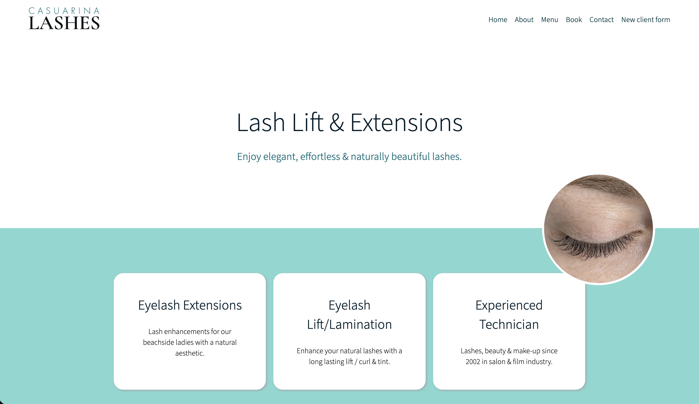
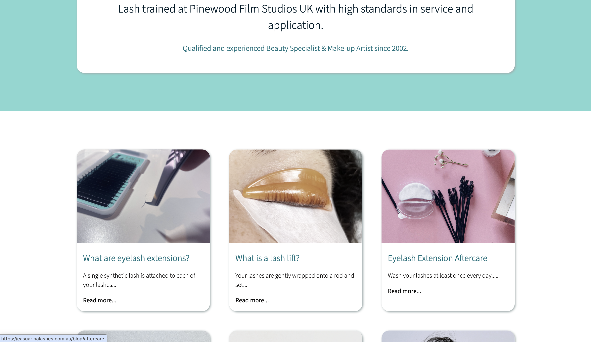

# Small business website built with react

I have a small side business offering eyelash services.

## Purpose of website

- Provide information about services
- Collect new client information
- Contact form
- Online appointment booking system

Link to website: https://casuarinalashes.com.au/

## Purpose of project

- How to set up, develop and deploy a react project.
- Learn foundations of React.js including props, components, css styling in React, useState and images.
- How to use React router

